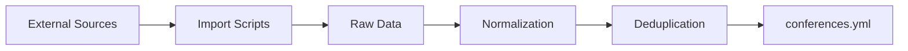

# Data Processing Pipeline

## Overview
The Python Deadlines data pipeline processes conference information through multiple stages of validation, enhancement, and distribution.

## Pipeline Stages

### 1. Data Import


**Sources:**
- Python.org Google Calendar (ICS)
- Python Organizers GitHub (CSV)
- Manual submissions (YAML)

**Import Scripts:**
- `utils/import_python_official.py` - ICS parser
- `utils/import_python_organizers.py` - CSV parser
- `utils/main.py` - Orchestrator

### 2. Data Validation

**Multi-layer Validation:**
1. **Pydantic Schema** (`utils/tidy_conf/schema.py`)
   - Type checking
   - Constraint validation
   - Field requirements

2. **Business Rules** (`utils/conferences/linters/`)
   - Date logic (CFP before conference)
   - Timezone validity
   - URL accessibility

3. **Data Enhancement**
   - Geocoding (OpenStreetMap Nominatim)
   - Timezone detection
   - Link validation

### 3. Data Processing

**Sort & Clean** (`utils/sort_yaml.py`):
```python
# Processing steps
1. Load YAML data
2. Validate schema
3. Add missing coordinates
4. Sort by CFP date
5. Archive past conferences
6. Write clean YAML
```

**Deduplication** (`utils/tidy_conf/deduplicate.py`):
- Fuzzy name matching (85% threshold)
- Year-based grouping
- Intelligent field merging

### 4. Auto-Archiving

**Archive Rules:**
- Conference end date < today → `archive.yml`
- CFP deadline passed → Keep until conference ends
- No CFP date → Manual decision

**Archive Structure:**
```yaml
# _data/archive.yml
2024:
  - conference: PyCon US 2024
    # ... full entry preserved
2023:
  - conference: EuroPython 2023
    # ... full entry preserved
```

### 5. Data Distribution

**Outputs:**
1. **Website** (Jekyll)
   - Conference listings
   - Countdown timers
   - Search functionality

2. **Calendar Feeds** (.ics)
   - CFP deadlines calendar
   - Conference dates calendar

3. **Newsletter** (`utils/newsletter.py`)
   - Weekly deadline reminders
   - Social media posts

4. **API Export** (JSON)
   - Machine-readable format
   - Third-party integrations

## Performance Optimizations

### Caching Strategy
- **Geocoding Cache**: Persistent location cache
- **Link Validation Cache**: 24-hour URL check cache
- **Build Cache**: Jekyll incremental builds

### Parallel Processing
- **CPU-bound**: Date processing, validation
- **I/O-bound**: Link checking, geocoding
- **Thread Pool**: 10 workers for I/O
- **Process Pool**: CPU count for computation

### Rate Limiting
- **Nominatim**: 1 request/second
- **Link Checking**: 5 concurrent connections
- **Import APIs**: Respect source limits

## Error Handling

### Graceful Degradation
1. **Missing Coordinates**: Log warning, continue
2. **Invalid URL**: Mark as needs_review
3. **API Timeout**: Use cached data
4. **Schema Violation**: Reject entry, log error

### Recovery Mechanisms
- Backup before processing
- Git integration for rollback
- Validation before commit
- Manual review queue

## Monitoring & Logging

### Log Levels
```python
DEBUG: Detailed processing steps
INFO: Normal operations
WARNING: Non-critical issues
ERROR: Processing failures
```

### Metrics Tracked
- Import success rate
- Validation pass rate
- Cache hit ratio
- Processing time
- Error frequency

## Automation

### GitHub Actions
```yaml
# .github/workflows/update-data.yml
schedule:
  - cron: '0 0 * * 1'  # Weekly on Monday
jobs:
  - Import from sources
  - Validate data
  - Generate newsletter
  - Create PR
```

### Pre-commit Hooks
- Schema validation
- YAML syntax check
- Python formatting
- Link validation (optional)

## Troubleshooting

### Common Issues

**Import Failures:**
- Check source availability
- Verify API credentials
- Review error logs

**Validation Errors:**
- Run with `--log-level DEBUG`
- Check schema changes
- Validate manually

**Performance Issues:**
- Clear caches if stale
- Check rate limiting
- Monitor API quotas

### Debug Commands
```bash
# Verbose validation
python utils/sort_yaml.py --log-level DEBUG

# Skip link checking (faster)
python utils/sort_yaml.py --skip_links

# Dry run (no writes)
python utils/sort_yaml.py --dry-run

# Force cache refresh
rm -rf .cache/
python utils/sort_yaml.py
```